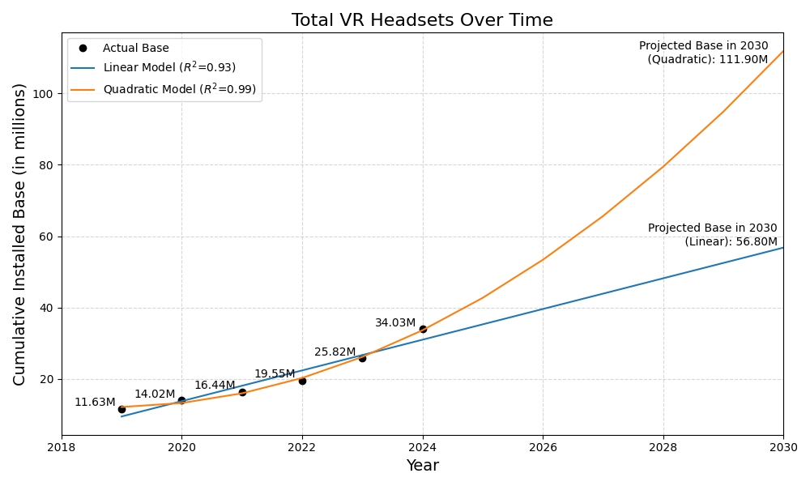
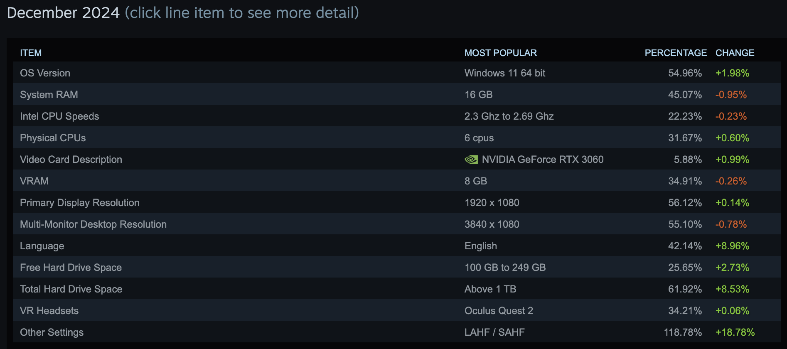
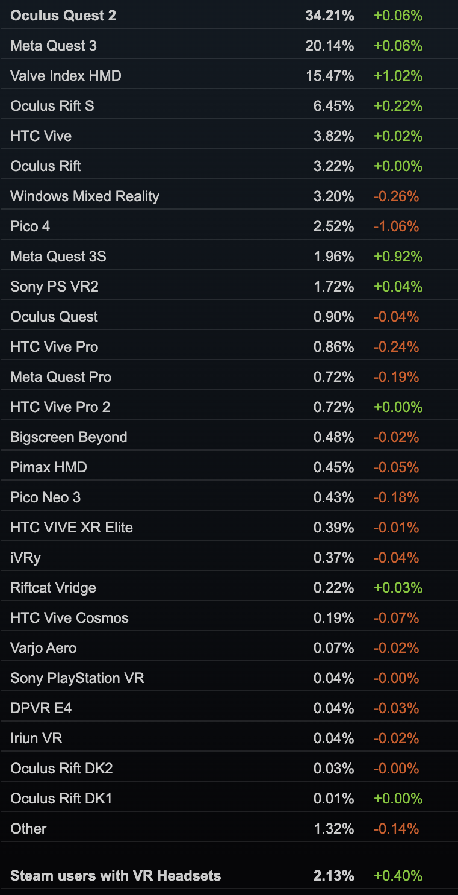
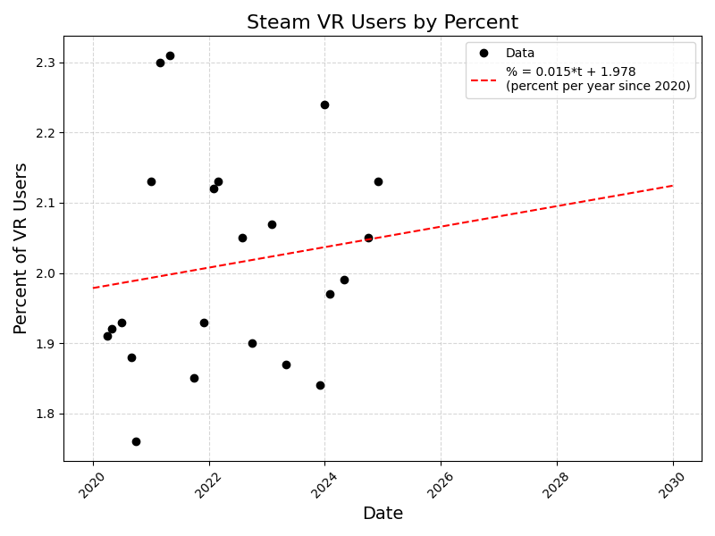
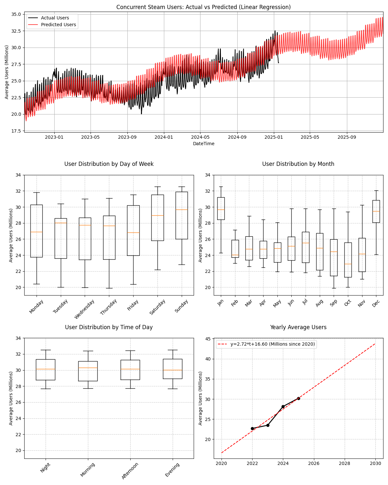
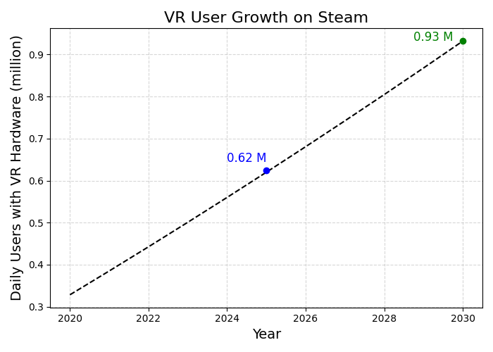

# VR Market Research and Future Projections

An investigation into the market of virtual reality hardware and projections for the future. 

## Total VR Headset Forecast

Estimating the total number of VR headsets in the future provides insight into the overall VR population and potential market size. However, it does not offer details on daily user engagement.



Two projections are used to track the total number of VR headsets over time. A linear and a quadratic model are employed, with the quadratic model providing a better fit. The linear model is included as it offers a more conservative estimate. 

Data: https://www.statista.com/statistics/677096/vr-headsets-worldwide/

Code: `headset_base_projection.py`

## Hardware Projection from Steam Survey

Gamers represent an ideal target audience for VR content. We can leverage the [Steam Hardware Survey](https://store.steampowered.com/hwsurvey/Steam-Hardware-Software-Survey-Welcome-to-Steam) to estimate the number of users who own VR hardware. The survey is conducted monthly and provides information on the hardware and software used by Steam users. Since the survey is voluntary, the results may not be representative of the entire Steam user base and as such introduces a bit of variance in the data.

An example of the survey results is shown below:



If you expand the VR Headset row then you can see the percentage of users with headsets and the fraction of users with each type of headset along with their change from the previous month. 



Another caveat with the hardware survey is that it only provides percentages of users with VR hardware and not the total number of users. To estimate the total number of users with VR hardware, we can use the [SteamDB](https://steamdb.info/charts/) to get the number of concurrent users on Steam and multiply it by the percentage with VR. Past hardware results aren't available on Steam's website directly but you can look up snapshots of the website on the internet archive, https://web.archive.org/ .

We compile a few years of data from the web archive and fit a linear model to estimate the percentage of users with VR hardware into 2030.



Code: `vr_by_percent.py`

The correlation is pretty noisy and not very significant but it does show a slight upward trend that doesn't seem unreasonable. Even though the percentage isn't growing very fast, the total number of users on Steam is growing and so the number of users with VR hardware should follow.

## User Projection from SteamDB

We can use the [SteamDB](https://steamdb.info/charts/) to get the number of concurrent users on [Steam](https://store.steampowered.com/). The data is available in a CSV format and can be downloaded from the SteamDB website. 



Code: `steam_user_projection.py`

## Total Concurrent Users with VR Hardware

By combining the hardware survey and SteamDB data, we can estimate the total number of concurrent users with VR hardware.

The percent growth of VR hardware is: 

```
vr_hardware [%] = 0.015 * t + 1.978
```

Combining that with the yearly growth of concurrent steam users, we can estimate the number of daily users with VR hardware.

```
users [million] = 2.72 * t + 16.60 
```

Each formula is relative to the year 2020 with `t` being years since. Combing each formula gives the total number of concurrent users with VR hardware.

```
vr_users = (vr_hardware[%] / 100) * users

 = (0.015 * t + 1.978) / 100 * (2.72 * t + 16.60)

 = 0.000408 t^2 + 0.0562916 t + 0.328348 (in millions)
```

Projecting that to 2030 looks like:



Code: `vr_growth_steam.py`

By 2030, roughly ~1M daily users on Steam are expected to have VR hardware. As of doing the survey today, the number of users with VR hardware is estimated to be ~620k. These numbers may seem small compared to the unit sales for individual headsets but remember these are daily users. Daily users usually comprise ~10% of the total user base.

## Subscription Forecasting

The number of users with VR hardware is expected to grow over time by a factor of ~1.5-3x by 2030. However, this growth is not guaranteed and may be affected by various factors such as the availability of content, the quality of the hardware, and the price of the hardware. We can still use sale estimates to forecast the number of users who will subscribe to a VR service or download a VR app. 

| Variables | Value | 
| --- | --- |
| Daily user percentage | 10% |
| Download rate | 5% |
| Subscription rate | 2% |
| Monthly churn rate | 5% |


| 2025 Estimate | Steam | Meta | Apple |
| --- | --- | --- | --- |
| Total VR users | 0.62M | [19.5M](https://www.roadtovr.com/meta-quest-2-monthly-active-users/) | [0.42M](https://www.macobserver.com/news/apple-vision-pro-sales-match-pre-launch-estimates/) |
| Daily users | 0.06M | 1.95M | 0.04M |
| Unique Downloads | 3000 | 97,500 | 2000 |
| Subscriptions | 62 | 1950 | 40 |
| Subscriptions after 1 year (churn) | 34 | 1050 | 22 |


